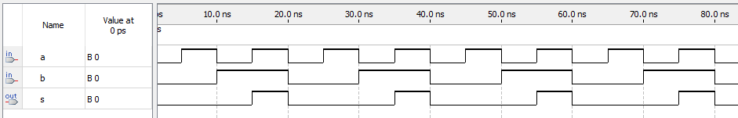
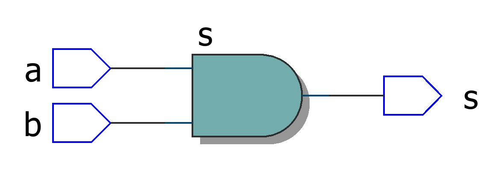

# Q2 - And Gate

Desenvolver a porta **AND** em VHDL e simular utilizando o Quartus.

## Implementation code in VHDL

[View File](./AndGate.vhd)

```vhdl
ENTITY AndGate IS
	PORT (
		a, b : IN BIT;
		s : OUT BIT
	);
END AndGate;

ARCHITECTURE main OF AndGate IS
BEGIN
	s <= a AND b;
END ARCHITECTURE main;
```

## Waves



## RTL Viewer



## Truth Table

[Download csv](./assets/truth_table.csv)

|INPUTS|FIELD2|OUTPUT   |
|------|------|---------|
|a     |b     |s = a ⋅ b|
|0     |0     |0        |
|1     |0     |0        |
|0     |1     |0        |
|1     |1     |1        |
