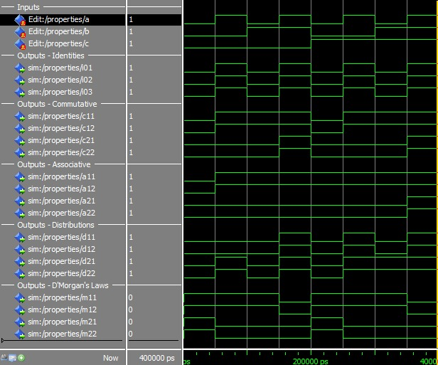
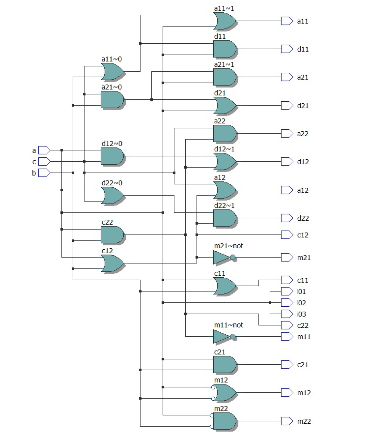

# Q3 - Properties

Desenvolver um código para que seja possível testar TODAS as propriedades, postulados e lei de De Morgan.

## Propriedades

A lógica booleana tem algumas propriedades que são respeitadas pelas portas AND, OR e
NOT, essas propriedades são extremamente úteis na simplificação de circuitos e de
expressões. Tal como na matemática comum, valem na Álgebra de Boole, propriedades
como: comutativa, associativa e distributiva.

### Comutativa

Esta propriedade é válida tanto na adição, como na multiplicação:

- Adição: 𝐴 + 𝐵 = 𝐵 + 𝐴;
- Multiplicação: 𝐴 ⋅ 𝐵 = 𝐵 ⋅ 𝐴.

### Associativa

Esta propriedade é válida tanto na adição, como na multiplicação:

- Adição: 𝐴 + (𝐵 + 𝐶) = (𝐴 + 𝐵) + 𝐶;
- Multiplicação: 𝐴 ⋅ (𝐵 ⋅ 𝐶) = (𝐴 ⋅ 𝐵) ⋅ 𝐶.

### Distributiva

- 𝐴 ⋅ (𝐵 + 𝐶) = 𝐴 ⋅ 𝐵 + 𝐴⋅𝐶;
- 𝐴 + (𝐵 ⋅ 𝐶) = (𝐴 + 𝐵) ⋅ ( 𝐴 + 𝐶).

## Postulados

A seguir serão apresentados os postulados de identidade para as operações de Adição
(Ou), Multiplicação (E) e Negação (Não)
Identidade:

1. 𝐴 + 0 = 𝐴
2. 𝐴 ⋅ 1 = 𝐴
3. (𝐴')' = 𝐴

## Teoremas de De Morgan

Os teoremas de De Morgan são muito empregados na prática, em simplificações de
expressões booleanas e, ainda, no desenvolvimento de circuitos digitais.
São duas leis:

- 1ª Lei de De Morgan: (𝐴 ⋅ 𝐵)' = 𝐴' + 𝐵';
- 2ª Lei de De Morgan: (𝐴 + 𝐵)' = 𝐴' ⋅ 𝐵'.

## Waves

## RTL Viewer

## Truth Table

[Download csv](./assets/truth_table.csv)

|Inputs| | |Outputs - Identities|   |   |Outputs - Commutative||       ||Outputs - Associative    |    |                      |          |Outputs - Distributions  |    |                      |          |Outputs - D'Morgan's Laws||           ||
|------|------|------|--------------------|---------|---------|---------------------|------|-------------|-------|-------------------------|-----------|-----------------------------|-----------------|-------------------------|-----------|-----------------------------|-----------------|-------------------------|-------|------------------|-------|
|      |      |      |                    |         |         |a + b = b + a        |      |a * b = b * a|       |a + (b + c) = (a + b) + c|           |a + (b*c) = (a + b) * (a + c)|                 |a * (b + c) = (a + b) + c|           |a * (b*c) = (a + b) * (a + c)|                 |(a * b)' = a' + b'       |       |(a + b)' = a' * b'|       |
|a     |b     |c     |a + 0 = a           |a * 1 = a|(a')' = a|a + b                |b + a |a * b        |b * a  |a + (b + c)              |(a + b) + c|a + (b*c)                    |(a + b) * (a + c)|a * (b + c)              |(a + b) + c|a * (b*c)                    |(a + b) * (a + c)|(a * b)'                 |a' + b'|(a + b)'          |a' * b'|
|0     |0     |0     |0                   |0        |0        |0                    |0     |0            |0      |0                        |0          |0                            |0                |0                        |0          |0                            |0                |1                        |1      |1                 |1      |
|1     |0     |0     |1                   |1        |1        |1                    |1     |0            |0      |1                        |1          |0                            |0                |0                        |0          |1                            |1                |1                        |1      |0                 |0      |
|0     |1     |0     |0                   |0        |0        |1                    |1     |0            |0      |1                        |1          |0                            |0                |0                        |0          |0                            |0                |1                        |1      |0                 |0      |
|1     |1     |0     |1                   |1        |1        |1                    |1     |1            |1      |1                        |1          |0                            |0                |1                        |1          |1                            |1                |0                        |0      |0                 |0      |
|0     |0     |1     |0                   |0        |0        |0                    |0     |0            |0      |1                        |1          |0                            |0                |0                        |0          |0                            |0                |1                        |1      |1                 |1      |
|1     |0     |1     |1                   |1        |1        |1                    |1     |0            |0      |1                        |1          |0                            |0                |1                        |1          |1                            |1                |1                        |1      |0                 |0      |
|0     |1     |1     |0                   |1        |1        |1                    |1     |0            |0      |1                        |1          |0                            |0                |0                        |0          |1                            |1                |1                        |1      |0                 |0      |
|1     |1     |1     |1                   |1        |1        |1                    |1     |1            |1      |1                        |1          |1                            |1                |1                        |1          |1                            |1                |0                        |0      |0                 |0      |
