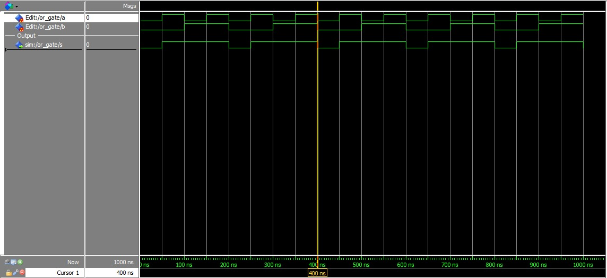
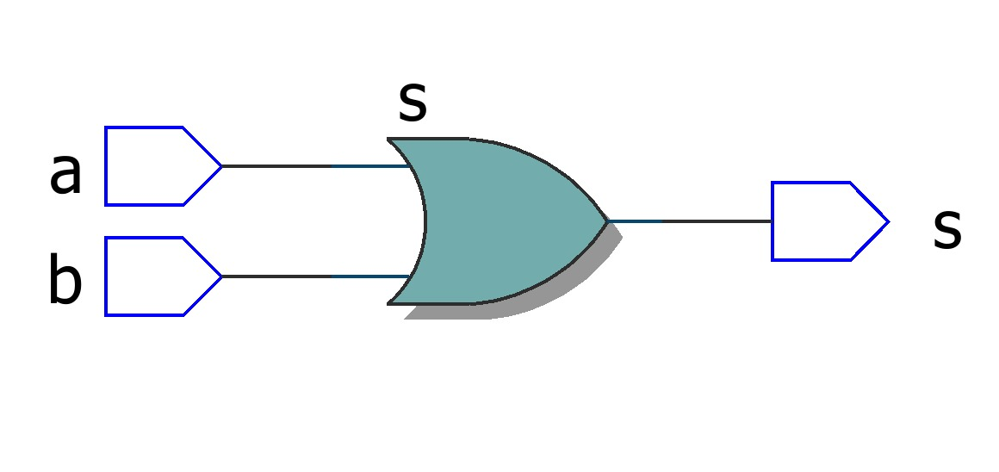

# Question 1 - Or Gate

Desenvolver a porta **OR** em VHDL e simular utilizando o Quartus.

## Implementation code in VHDL

[View File.](./or_gate.vhd)

```vhdl
entity or_gate is
	port (
		a	: in bit;
		b 	: in bit;
		s	: out bit
	);
end or_gate;

architecture top of or_gate is
begin 
	s <= a or b;
end top;
```

## Waves



## RTL Viewer



## Truth Table

[Download csv.](./assets/truth_table.csv)

|INPUTS|FIELD2|OUTPUT   |
|------|------|---------|
|a     |b     |s = a + b|
|0     |0     |0        |
|1     |0     |1        |
|0     |1     |0        |
|1     |1     |1        |
