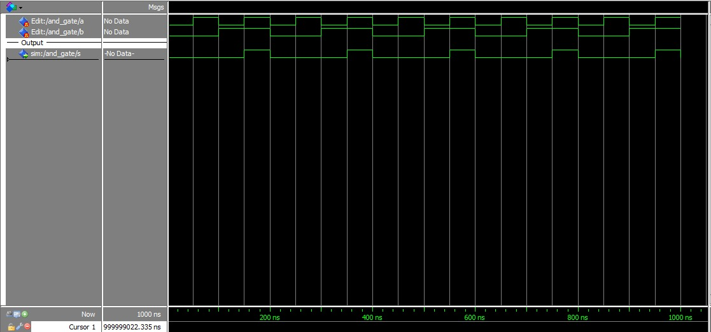
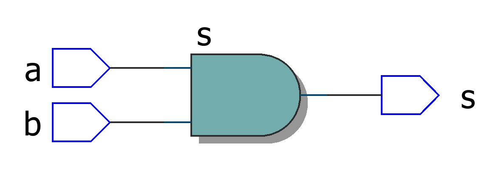

# Question 2 - And Gate

Desenvolver a porta **AND** em VHDL e simular utilizando o Quartus.

## Implementation code in VHDL

[View File.](./and_gate.vhd)

```vhdl
entity and_gate is
	port(
		a, b : in bit;
		s    : out bit
	);
end and_gate;

architecture main of and_gate is
begin

	s <= a and b;
	
end architecture main;
```

## Waves



## RTL Viewer



## Truth Table

[Download csv.](./assets/truth_table.csv)

|INPUTS|FIELD2|OUTPUT   |
|------|------|---------|
|a     |b     |s = a ⋅ b|
|0     |0     |0        |
|1     |0     |0        |
|0     |1     |0        |
|1     |1     |1        |
