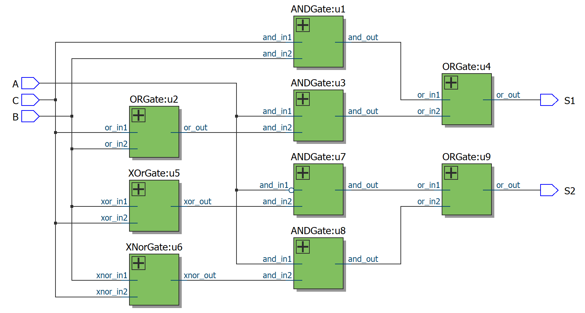
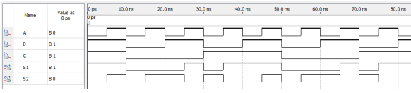

# Laboratório 2 - Circuitos Combinacionais

## Objetivos

1. Construir circuitos combinacionais complexos a partir de portas lógicas simples;
2. Testar a utilização do VHDL como ferramenta para descrever circuitos complexos fazendo uso de subprojetos;
3. Pôr em prática conceitos aprendidos na disciplina Circuitos Digitais - Teoria.

## Introdução Teórica

Uma das descrições que o VHDL permite é a descrição estrutural. Nesta descrição todos os componentes e suas interconexões, nas quais há atribuições de sinais, são feitas através do mapeamento de entradas e saídas de componentes. Ou seja, é como se fosse uma lista de ligações entre componentes básicos pré-definidos.
Para projetos grandes ou projetos em que mais de uma pessoa está trabalhando, é viável a utilização de componentes. Um componente interliga entidades de modo a criar uma hierarquia entre elas. Outra utilidade da utilização de componentes é a não repetição de comandos que serão muito utilizados. Basicamente, um componente é dividido em declaração e instanciação.

Para utilizar um componente, é necessário que o arquivo VHDL do componente que está sendo utilizado esteja na mesma pasta onde o projeto será compilado e executado.

## Atividade Laborial

Vamos projetar um circuito que conta o número de bits iguais a 1 presente em três entradas (A, B, C) e, como saída, fornece esse número em binário, por meio de duas saídas S1 e S2.

### Exemplo

- Se a entrada for ABC = 111, então a saída deve produzir o número 3 em binário, ou seja: S1S2 = 11;
- Se a entrada for 100, então a saída deve produzir o número 1 em binário, ou seja: S1S2 = 01;
- Se a entrada for 000, então a saída deve produzir o número 0 em binário, ou seja: S1S2 = 00.

O número de 1’s nas entradas pode variar de 0 a 3. Assim, uma saída com dois bits é o suficiente. Um circuito contador de 1’s pode ser útil em diversas situações, como, por exemplo, estacionamentos em que sensores, localizados na parte superior das vagas e conectados a sinais luminosos, informam aos motoristas o número de vagas disponíveis em um andar específico.

#### Como tarefa serão realizados os seguintes experimentos:

1. Monte a tabela verdade do circuito, explicitando quais são as entradas e quais são as saídas e todas as possibilidades que o circuito lógico pode valer.
2. A equação do circuito é: 

```vhdl
𝑆1 = 𝐴'⋅𝐵⋅𝐶 + 𝐴⋅𝐵'⋅𝐶 + 𝐴⋅𝐵⋅𝐶' + 𝐴⋅𝐵⋅𝐶
𝑆2 = 𝐴'⋅𝐵'⋅𝐶 + 𝐴'⋅𝐵⋅𝐶' + 𝐴⋅𝐵' · 𝐶' + 𝐴⋅𝐵⋅𝐶
```

É possível simplificar utilizando alguns dos postulados e identidades da lógica Booleana? Se sim, mostre qual a menor equação do circuito que você consegue obter.

1. Represente os circuitos na forma de portas lógicas (caso simplifique a equação, represente o circuito simplificado).
2. Descreva o circuito em VHDL e simule-o utilizando o Quartus/Modelsim. Para utilizar
as portas lógicas, crie um projeto separado para cada porta e utilize o comando
“COMPONENT” e “PORT MAP”.
3. Elabore e entregue um relatório contendo a execução correta dos itens 1 a 4.

## Resultados

Abaixo está a visualização do RTL gerado pelo programa



A simulação do contador de bits altos é mostrada abaixo. Considere que `S1` é o mais significativo.

