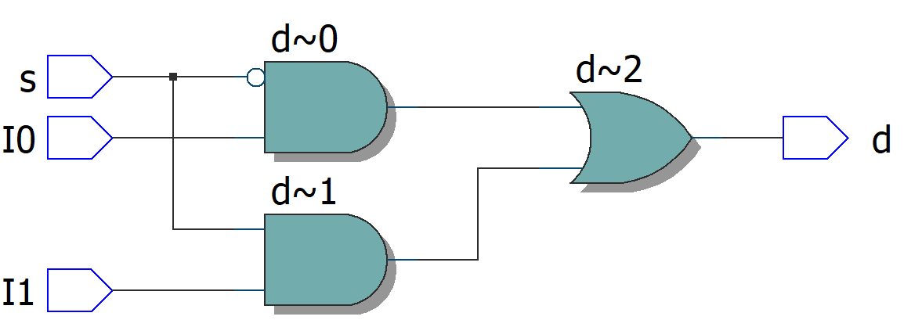
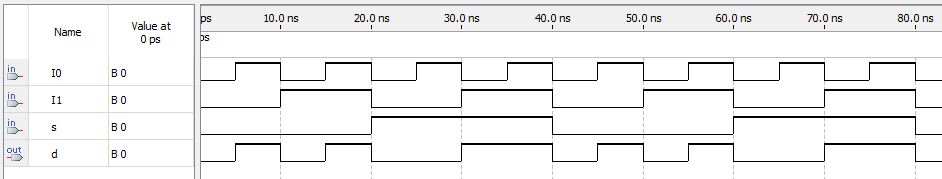

# Mux2x1 - Logic Circuits

## Implementation

Implementation of a 2x1 multiplexer using logic circuits.

### Mux4x1

```vhdl
entity Mux2x1 is
    port(
        s, a, b : in bit;
        x : out bit
    );
end entity;

architecture main of Mux2x1 is
begin
    x <= (not(s) and a) or (s and b);
end architecture;
```

## RTL diagram



## Waves


