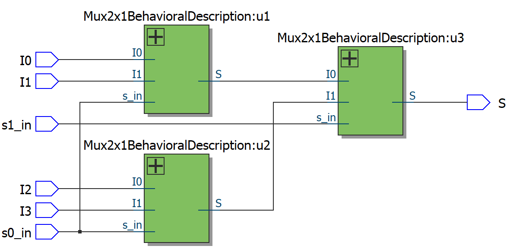

# Mux4x1 with Mux4x2 - behavioral description

## Implementation

More complex multiplexers can be built using 2x1 multiplexers. The example below demonstrates the assembly of a 4x1 multiplexer using 2x1 multiplexer components

### MUX2x1

```vhdl
ENTITY Mux2x1 IS
	PORT (
		I0, I1, s_in : IN BIT;
		S : OUT BIT
	);
END;

ARCHITECTURE behav OF Mux2x1 IS
BEGIN
	WITH s_in SELECT
		S <= I0 WHEN '0',
		I1 WHEN '1';
END;
```

### MUX4x1 Using MUX2x1 as a component

```vhdl
ENTITY Mux4x1 IS
  PORT (

    -- Inputs
    I0, I1, I2, I3 : IN BIT;

    -- Signals
    s0_in, s1_in : IN BIT;

    -- Output
    S : OUT BIT

  );
END Mux4x1;

ARCHITECTURE behav OF Mux4x1 IS

  SIGNAL D0 : BIT;
  SIGNAL D1 : BIT;

  COMPONENT Mux2x1 IS
    PORT (
      I0, I1, s_in : IN BIT; -- I0 : LSB
      S : OUT BIT
    );
  END COMPONENT;

BEGIN

  -- 1° MUX recebe I0 e I1, om seletor s0_in

  u1 : Mux2x1 PORT MAP(
    I0 => I0,
    I1 => I1,
    s_in => s0_in,
    S => D0
  );

  -- 2° MUX recebe I2 e I3, com seletor s0_in

  u2 : Mux2x1 PORT MAP(
    I0 => I2,
    I1 => I3,
    s_in => s0_in,
    S => D1
  );

  -- Último MUX recebe D0 e D1, com seletor s1_in

  u3 : Mux2x1 PORT MAP(
    I0 => D0,
    I1 => D1,
    s_in => s1_in,
    S => S
  );

END ARCHITECTURE;
```

## RTL diagram



## Waves


## Truth table

| S0_in | S1_in | S  |
|-------|-------|----|
| 0     | 0     | I0 |
| 0     | 1     | I1 |
| 1     | 0     | I2 |
| 1     | 1     | I3 |
