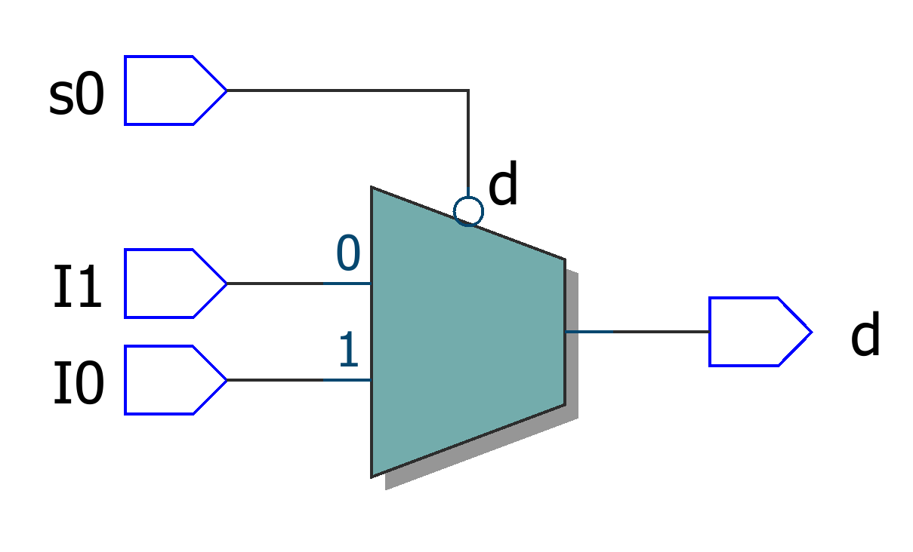
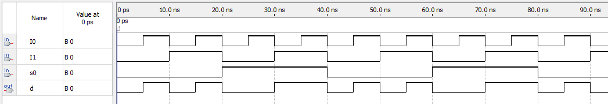

# Mux2x1 - behavioral description

## Implementation

Implementation of a 2x1 multiplexer using behavioral description.

### Mux2x1

```vhdl
ENTITY Mux2x1BehavioralDescription IS
	PORT(
		I0, I1, s_in : IN BIT;
		S            : OUT BIT
	);
END;

ARCHITECTURE behav OF Mux2x1BehavioralDescription IS
BEGIN
WITH s_in SELECT
	S <= I0 WHEN '0',
		   I1 WHEN '1';
END;
```

## RTL diagram



## Waves

