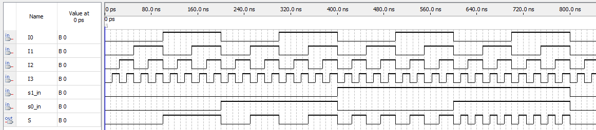

# Mux4x1 - behavioral description

## Implementation

Implementation of a 4x1 multiplexer using behavioral description.

### Mux4x1

```vhdl
ENTITY Mux4x1BehavioralDescription IS
	PORT(
		I0, I1, I2, I3, s0_in, s1_in : IN BIT;
		S                            : OUT BIT
	);
END;

ARCHITECTURE behav OF Mux4x1BehavioralDescription IS
BEGIN
WITH (s1_in & s0_in) SELECT
	S <= I0 WHEN "00",
		   I1 WHEN "01",
       I2 WHEN "10",
       I3 WHEN "11";
END;

```

## RTL diagram


## Waves



## Truth table

| S0_in | S1_in | S  |
|-------|-------|----|
| 0     | 0     | I0 |
| 0     | 1     | I1 |
| 1     | 0     | I2 |
| 1     | 1     | I3 |