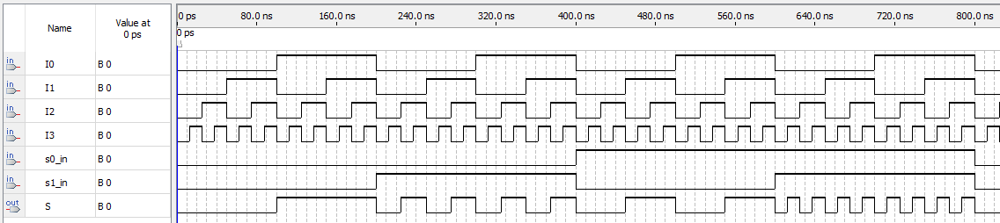

# Mux4x1 with Mux4x2 - behavioral description

## Implementation

More complex multiplexers can be built using 2x1 multiplexers. The example below demonstrates the assembly of a 4x1 multiplexer using 2x1 multiplexer components

### MUX2x1

```vhdl
ENTITY Mux2x1BehavioralDescription IS
	PORT(
		I0, I1, s_in : IN BIT;
		S            : OUT BIT
	);
END;

ARCHITECTURE behav OF Mux2x1BehavioralDescription IS
BEGIN
WITH s_in SELECT
	S <= I0 WHEN '0',
		   I1 WHEN '1';
END;
```

### MUX4x1 Using MUX2x1 as a component

```vhdl
entity mux4x1_behavioral_description is
  port(
    I0, I1, I2, I3 : in bit; -- Inputs
    s0_in, s1_in    : in bit; -- Signals
    S              : out bit -- Output
  );
end mux4x1_behavioral_description;

architecture behav of mux4x1_behavioral_description is
  signal S0: bit;
  signal S1: bit;
  component Mux2x1BehavioralDescription is
    port(
      I0, I1, s_in : in bit;
      S            : out bit
    );
  end component;
  
begin
  u1 : Mux2x1BehavioralDescription port map(I0 => I0, I1 => I1, s_in => s1_in, S => S0);
  u2 : Mux2x1BehavioralDescription port map(I0 => I2, I1 => I3, s_in => s1_in, S => S1);
  u3 : Mux2x1BehavioralDescription port map(I0 => S0, I1 => S1, s_in => s0_in, S => S);
end architecture;
```

## RTL diagram


## Waves



## Truth table

| S0_in | S1_in | S  |
|-------|-------|----|
| 0     | 0     | I0 |
| 0     | 1     | I1 |
| 1     | 0     | I2 |
| 1     | 1     | I3 |