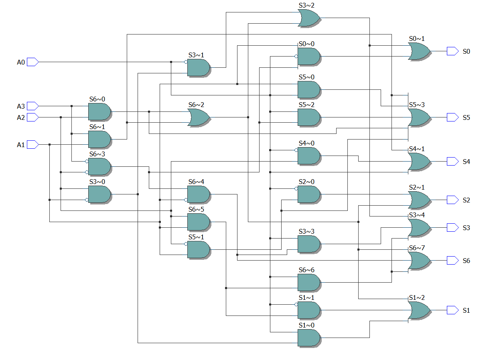
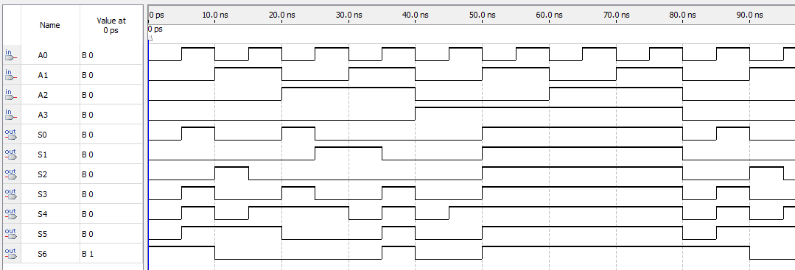

# Laboratório 04 - Decodificadores e Codificadores

## Objetivos

Descrever um display de sete segmentos em VHDL utilizando portas lógicas e a descrição comportamental.

### Legenda

SSD significa Seven Segment Display

LC é a implementação por circuitos lógicos

BD é a implementação pro descrição comportamental

## Resultados

Abaixo o RTL do display utilizando portas lógicas

A simulação do display pode ser visualizada abaixo. Considere A0 e S0 como os menos significativos.

