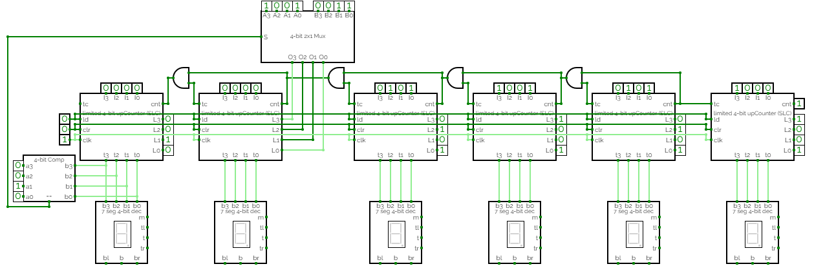

# Componentes 

## Introdução

A ideia dessa pasta é ter a implementação dos componentes que serão utilizados para o projeto final da disciplina de Circuitos Digitais. Aqui, serão implementados os seguintes componentes

`component UpCounterSLC` contador crescente de quatro bits com funções de load e clear síncronos

`component LimitedUpCounter`contador crescente limitado

`component SSDisplay` display de sete segmentos

## Estrutura

`/src` tem os arquivos para construção do projeto final

`/components` tem as pastas dos componentes implementados para serem utilizados na pasta `/src`

## Objetivo

Abaixo está o datapath do relógio digital que se pretende montar utilizando os componentes acima. Ele está organizado em um componente chamado chamado de `DigitalClock`

Este projeto pode ser acessado [neste link](https://circuitverse.org/simulator/embed/tests-425a9ce7-9d2c-4cc8-853e-6f8a1b4e7ec4)

A ideia é fazer duas instâncias de `DigitalClock` para montar um relógio de dois modos: o primeiro modo mostra a hora atual e o outro um cronômetro crescente.